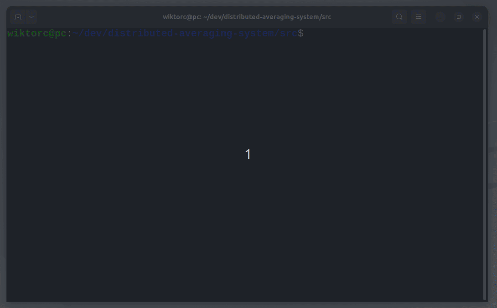
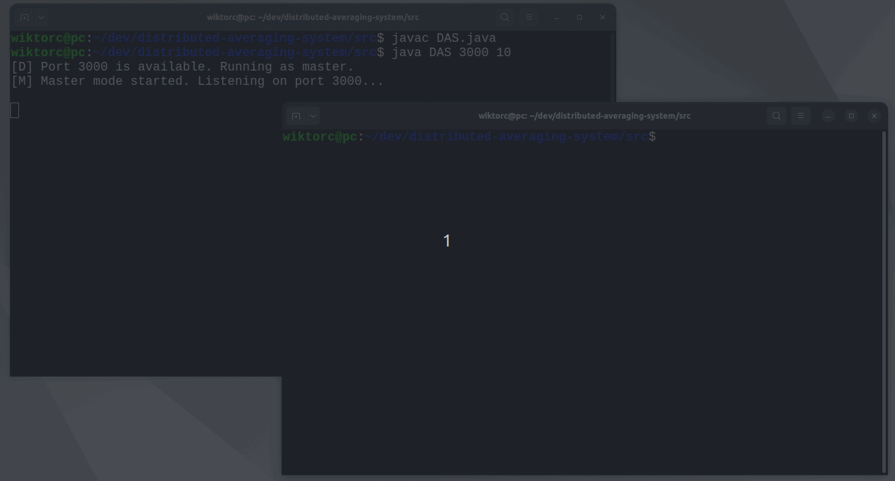
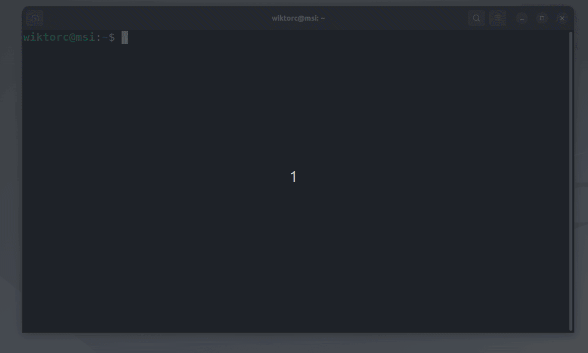
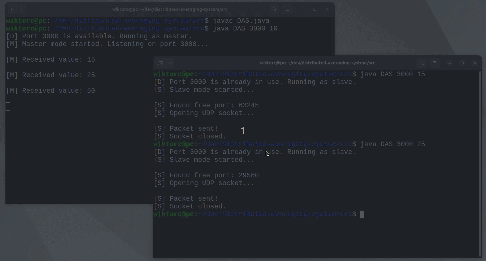
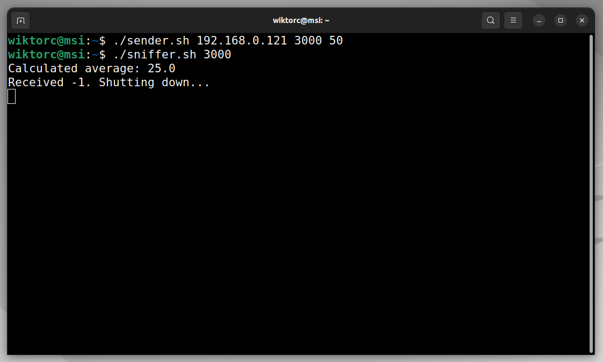

# 💻 Distributed Averaging System

## 👀 About

Distributed Averaging System is app that operates in two modes: master and slave. The purpose of the application is to collect numerical data from various instances of the program and calculate the average of these numbers. The application uses the UDP communication protocol to transfer data between devices in the local network.

## 📋 How the application works

### General

The application consists of, among others, a program implementing the DAS (Distributed Averaging
System) started with the command:
```bash
java DAS <port> <number>
```
where ```<port>``` is a number specifying the UDP port number and ```<number>``` is an integer.
The application works in two modes: master and slave. The mode selection is automatic
when the application is launched based on the current system state and the specified state
parameter. When launched, the application tries to create a UDP socket by opening a
UDP port with the number given by the ```<port>``` parameter. This operation can have two results:

- The application succeeds to open the requested port. This is where the app comes in
in **master mode**.
- The application fails to open the port because it is already occupied. In this case, the application
starts working in **slave mode**.

### Master mode

Application working in master mode remembers value passed as the  ```<number>``` parameter
and then receives messages cyclically in a loop through the socket on port ```<port>```. Next application operations depends on value of the number received in the message:

- If this value is different than ```0``` and ```-1```, the process writes this value to the console and remembers it.
- If this value is ```0```, the process:
	*  Calculates the average value of all non-zero numbers received from start of work, including the ```<number>``` value.
	* Writes average value to the console.
	* Using the socket, on which it is working, it sends a broadcast message to all computers in its local network to port number ```<port>``` (the same one, on which it works on) containing the calculated average value.
- If this value is ```-1```, the process:
	* Writes this value to the console.
	* Using the socket, on which it is working, it sends a broadcast message to all computers in its local network to port number ```<port>``` (the same one, on which it works on) containing ```-1``` value.
	* Closes the socket and ends work.

### Slave mode

An application working in slave mode creates a UDP socket by opening a random UDP port
number (relying on the operating system in this respect) and then using
this socket, sends it to a process working on the same machine on port number
```<port>``` message containing the value of the ```<number>``` parameter. After doing this
the process terminates.

## 🔧 Tech Stack

- Java 8
- Bash

## ▶️ Run

Clone the project

```bash
git clone git@github.com:P4ZD4N/distributed-averaging-system.git
```

Navigate to the project source directory

```bash
cd /path/to/distributed-averaging-system/src
```

Compile DAS class

```bash
javac DAS.java
```

Run app

```bash
java DAS <port> <number>
```

## ⚙️ Bash scripts

I created two additional bash scripts: `sender.sh` and `sniffer.sh`. They are intended for working with app from other computers in our local network (from any computer on which we do not have instance of master yet). 

`sender.sh`
This script can help you with sending numbers to the master from different computer. If you know IP address of the computer, on which the master is running and port, on which it receives the numbers. Usage:
```bash
./sender.sh <ip_address> <port> <number_to_send>
```

<br>

`sniffer.sh`
Because master sends a broadcast message to all computers in its local network on the port, on which it works, we have opportunity to receive such messages on different computer. We can do it using this script. Usage:
```bash
./sniffer.sh <port>
```

## 📺 Demo

GIF below presents compilation of app and running it in master mode on port 3000. 10 is first number, which is remembered by master.


GIF below presents running app in slave mode, because port 3000 is already occupied. 15 and 25 is sending to master and remembered.


GIF below presents running sender and sniffer scripts on different computer. Firstly (with invocation of sender) script sends 50 to master. Next, sniffer is waiting for messages broadcasted by master.


GIF below presents running app in slave mode to send 0 and -1 numbers. 0 causes the average calculated from all numbers received so far to be broadcast. -1 shuts down app.


Image below presents effect of sending 0 and -1, which was shown on previous GIF. As you can see sniffer received both messages broadcasted by master.

